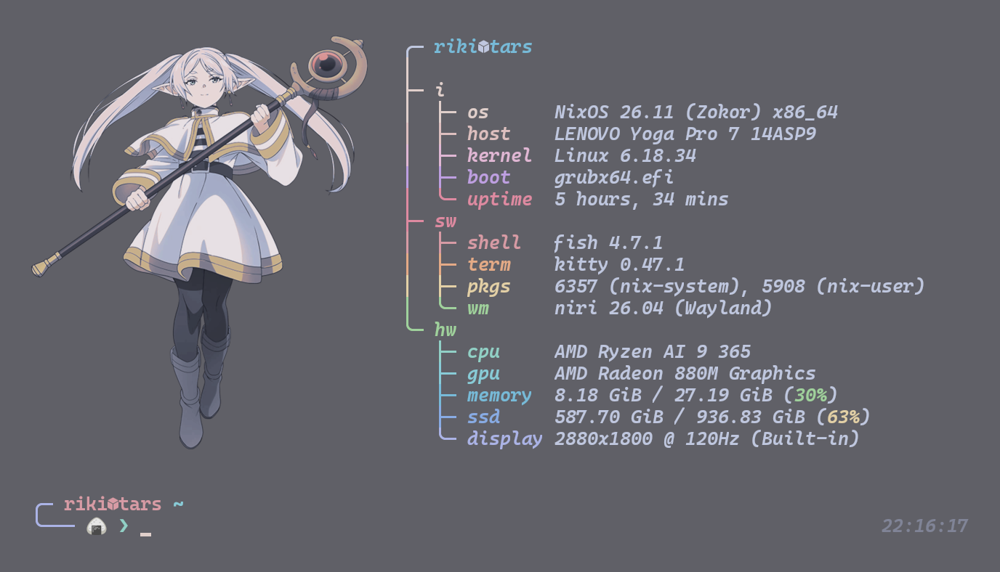

# ✨ Riki's wondrous NixOS config ✨

My (Riki) wondrous daily driver config: this is still very much a work in progress (and probably it will never not be as such) and there is probably a better way to do this but I'm a newbie. Enjoy the madness.

My latest considerations:

- Niri is crazy good!
- Why did I choose NixOS, this is pain...
- NixOS is crazy good, I would never use something else!
- Why does ROS 2 run only on Ubuntu?
- I like goblins.

## ❄️ Premise

The config is for both my laptop (`tars`) and my desktop (`case`). The systems are built using a NixOS flake and the packages are (mostly) managed through home manager.

## 💻 Desktop Environment

| (╯°□°）╯︵ ┻━┻    |                 |
| ----------------- | --------------- |
| Window manager    | niri <3         |
| Taskbar           | waybar          |
| App launcher      | tofi            |
| Idle manager      | hypridle        |
| Lock screen       | hyprlock        |
| Login manager     | \*              |
| Terminal emulator | ghostty / kitty |
| Shell             | fish            |
| File manager      | nautilus        |

---

\* I don't use a login manager, I just autologin and launch hyprlock (I know it is not secure, but I do it anyway, I like it risky).

## 📁 How does it work?

```
.
├── assets
├── dev-shells
├── hosts
│   ├── case
│   ├── shared
│   └── tars
├── users
│   └── riki
│       ├── assets
│       ├── case
│       ├── shared
│       ├── tars
│       └── home.nix
└── flake.nix
```

The config is split between `hosts` and `users`: the first contains the system config (what should usually be declared in configuration.nix in a fresh install), while the latter contains the user configs. The flake specifies what parts of the configs each system (`tars` or `case`) imports.

Both `hosts` and `users` use the same philosophy: `shared` holds the modules and config common to both machines, while `case`/`tars` hold the system-specific parts; the flake wires them together for each host.

## 🖼️ Gallery [16.06.2026]




Goblins...
